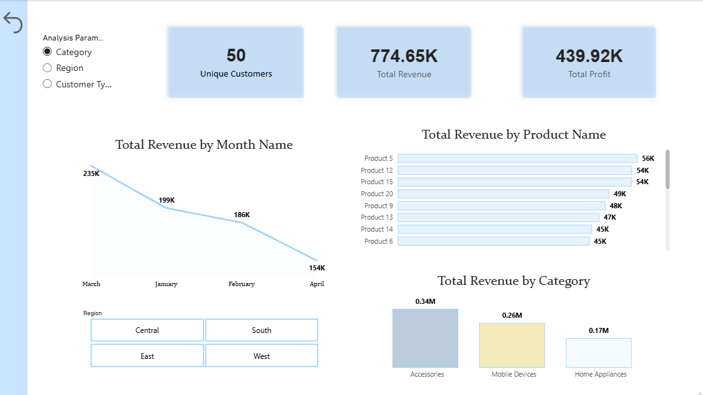
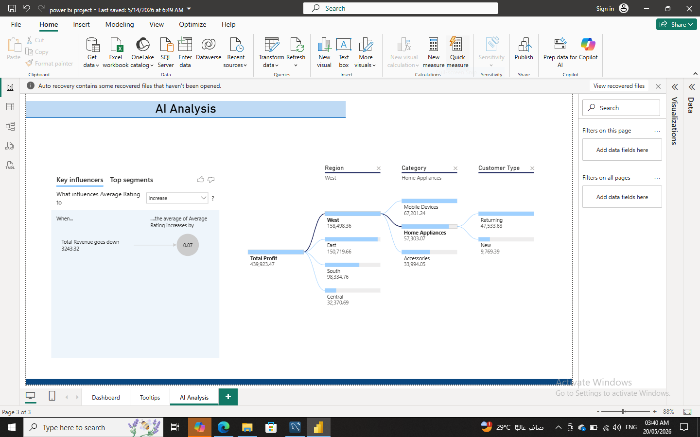
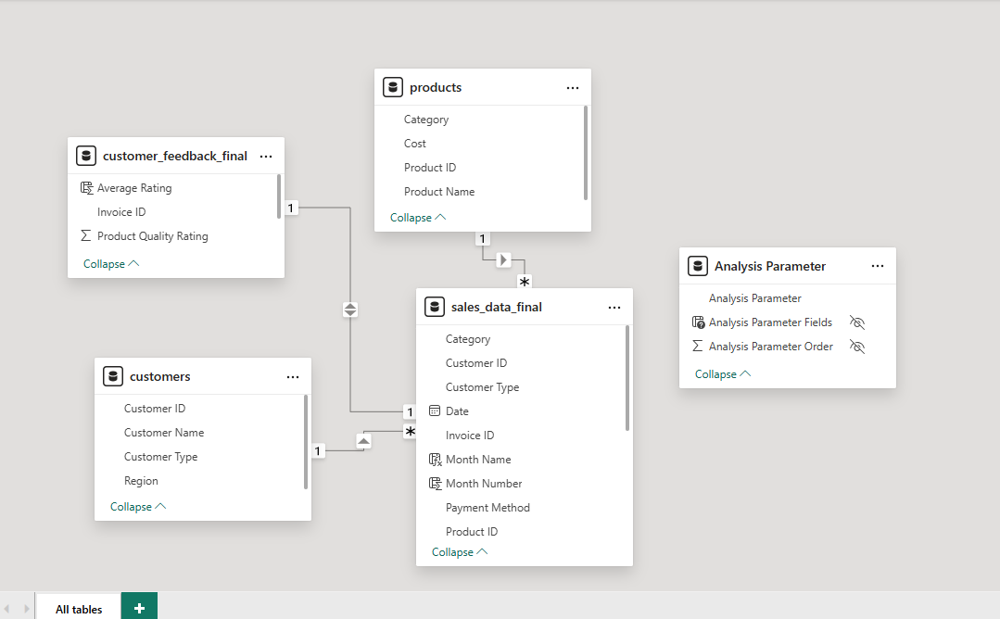
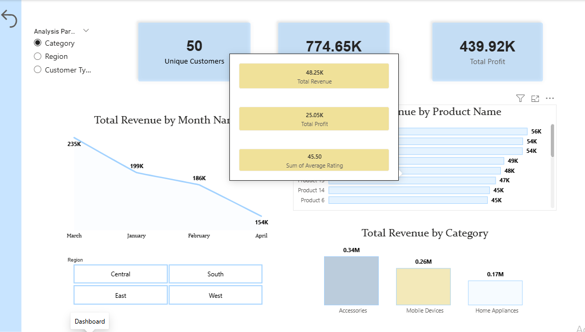

# Sales & Customer Insights Project (End-to-End)

##  Project Overview
This end-to-end Business Intelligence project delivers a comprehensive, data-driven analysis of sales performance, profitability, and customer satisfaction. By transforming raw transactional data into actionable insights, this interactive Power BI dashboard empowers stakeholders to track regional trends, optimize product categories, and uncover key drivers affecting customer experience.

---

##  Tech Stack & Tools Used
* **Power BI Desktop** (Data Modeling, DAX, & Visualization)
* **Power Query** (ETL - Data Extraction, Cleaning, and Transformation)
* **DAX (Data Analysis Expressions)** (Advanced calculated measures and KPIs)
* **AI Visuals** (Key Influencers, Decomposition Tree for root-cause analysis)

---

##  Data Architecture & Modeling
The project utilizes a robust **Star Schema** architecture to ensure optimized query performance and intuitive filtering across dimensions.

* **Fact Table:** `sales_data_final` (Contains core transactional metrics: Revenue, Quantity, Profit, and Dates)
* **Dimension Tables:**
  * `products` (Product Category, Sub-category, Product ID)
  * `customers` (Customer ID, Name, Segment, Region)
  * `customer_feedback_final` (Invoice ID, Average Rating, Product Quality Rating)
* **Relationship Management:** Bi-directional and single-direction filters are carefully implemented to maintain data integrity between sales performance and customer feedback metrics.

---

##  Key Features & Analytical Deep Dives

### 1. Financial Performance Analysis
* Dynamic tracking of **Total Revenue** ($774.65K) and **Total Profit** ($439.92K).
* Monthly revenue trend analysis to identify seasonality and growth velocity.
* Product category performance mapping (Accessories vs. Mobile Devices vs. Home Appliances).

### 2. Customer Satisfaction & Feedback Loop
* Integration of customer feedback scores directly alongside sales metrics.
* Regional analysis of satisfaction rates to pinpoint underperforming markets.

### 3. AI-Driven Insights
* **Key Influencers:** Automated analysis to instantly identify factors that drive customer ratings up or down.
* **Decomposition Tree:** Interactive root-cause visualization enabling users to drill down from total profit into Region, Category, and Customer Type smoothly.

### 4. Advanced UX/UI Features
* **Custom Tooltips:** Hovering over visuals reveals custom tooltips breaking down specific metrics (Revenue, Profit, and Ratings) without cluttering the main screen.
* **Slicers & Filters:** Intuitive parameter controls filtering data by Category, Region, and Customer Type dynamically.

---

##  Dashboard Preview

###  Executive Summary & Main View
*Tracks high-level KPIs, revenue trends, and category distribution at a glance.*

###  AI-Powered Analytics
*Utilizes machine learning visuals to detect key feedback influencers and profit breakdown.*

###  Data Model Schema (Star Schema)
*The back-end structure showcasing standard relational database design for BI tools.*

###  Interactive Custom Tooltips
*Enhanced user experience providing deeper granular details on-hover.*

---

##  Business Impact & Outcomes
* **Data-Driven Decisions:** Enables executive teams to align inventory and marketing strategies with the highest-grossing product categories.
* **Enhanced Customer Experience:** Bridges the gap between sales volume and customer satisfaction, allowing management to resolve regional quality issues proactively.
* **Operational Efficiency:** Reduces report-generation time by replacing static files with a fully automated, interactive environment.

---

##  Author
* **Areej Almutairi**
* **Role:** Data Analyst & Business Intelligence Professional
