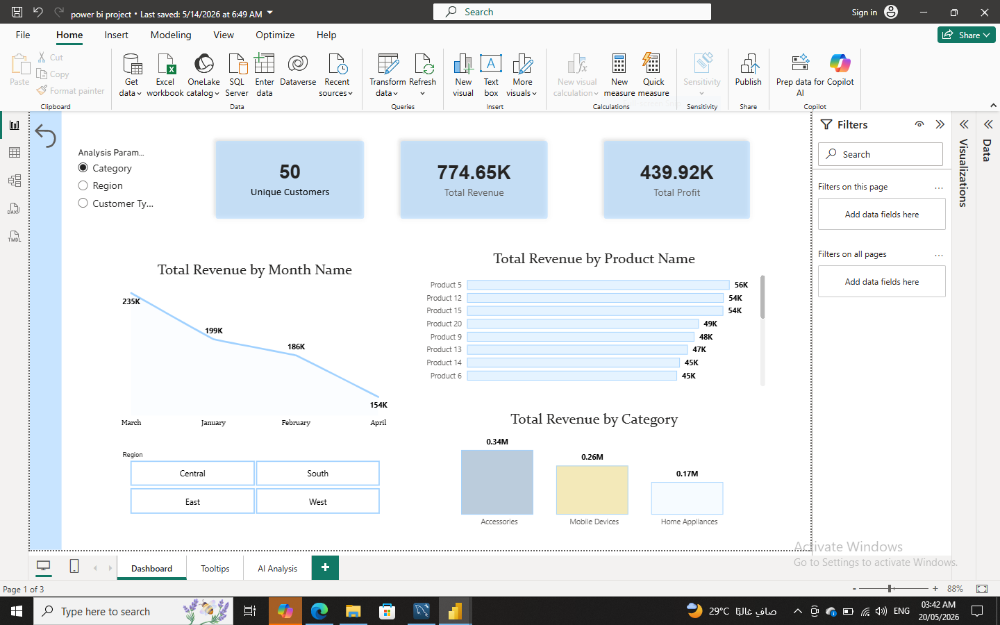
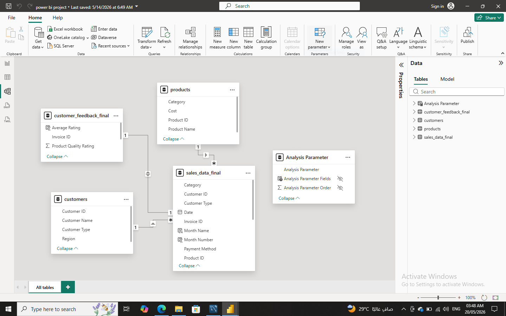

# sales_customer_analytics_powerbi
End-to-end Power BI business intelligence project analyzing sales performance, profitability, and customer satisfaction.

# Sales & Customer Analytics Project

## Overview
This project is an end-to-end Power BI business intelligence project designed to analyze sales performance, profitability, and customer satisfaction.

---

## Tools Used
- Power BI
- DAX
- Data Modeling
- Data Visualization
- KPI Reporting
- AI Visuals (Key Influencers, Decomposition Tree)

---

## Project Structure
- Database: Contains all datasets used in the analysis
- Screenshots: Visual previews of dashboards and insights
- Power BI File: Main report file (.pbix)

---

## Key Features
- Revenue & Profit Analysis
- Customer Satisfaction Analysis
- Interactive Dashboard
- KPI Cards
- AI-driven insights using Power BI visuals
- Drill-down analysis using filters and parameters

---

## AI Insights
- Key Influencers used to identify factors affecting customer ratings
- Decomposition Tree used to analyze profit by region, category, and customer type

---

## Business Impact
This project helps identify key drivers of profitability and customer satisfaction, enabling better business decision-making through interactive analytics

---

## Dashboard Preview

## AI Insights

## Data Model

## Tooltips

---

## Outcome
The project provides actionable business insights to support data-driven decision-making and improve business performance.

---

## Author
Areej Almutairi
